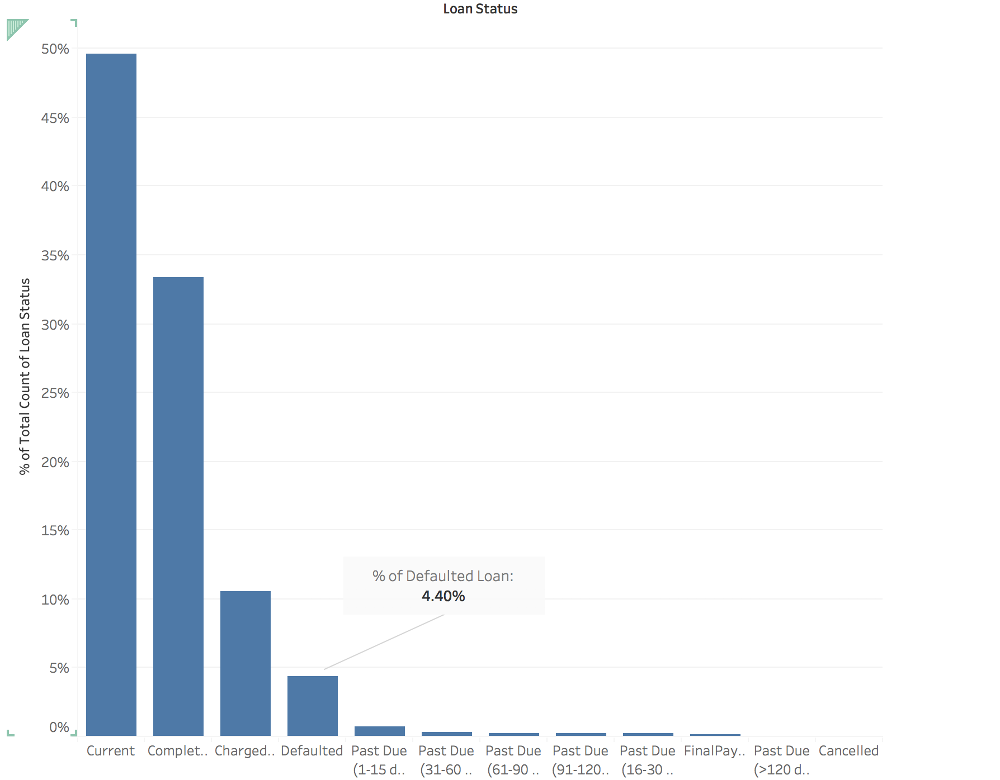
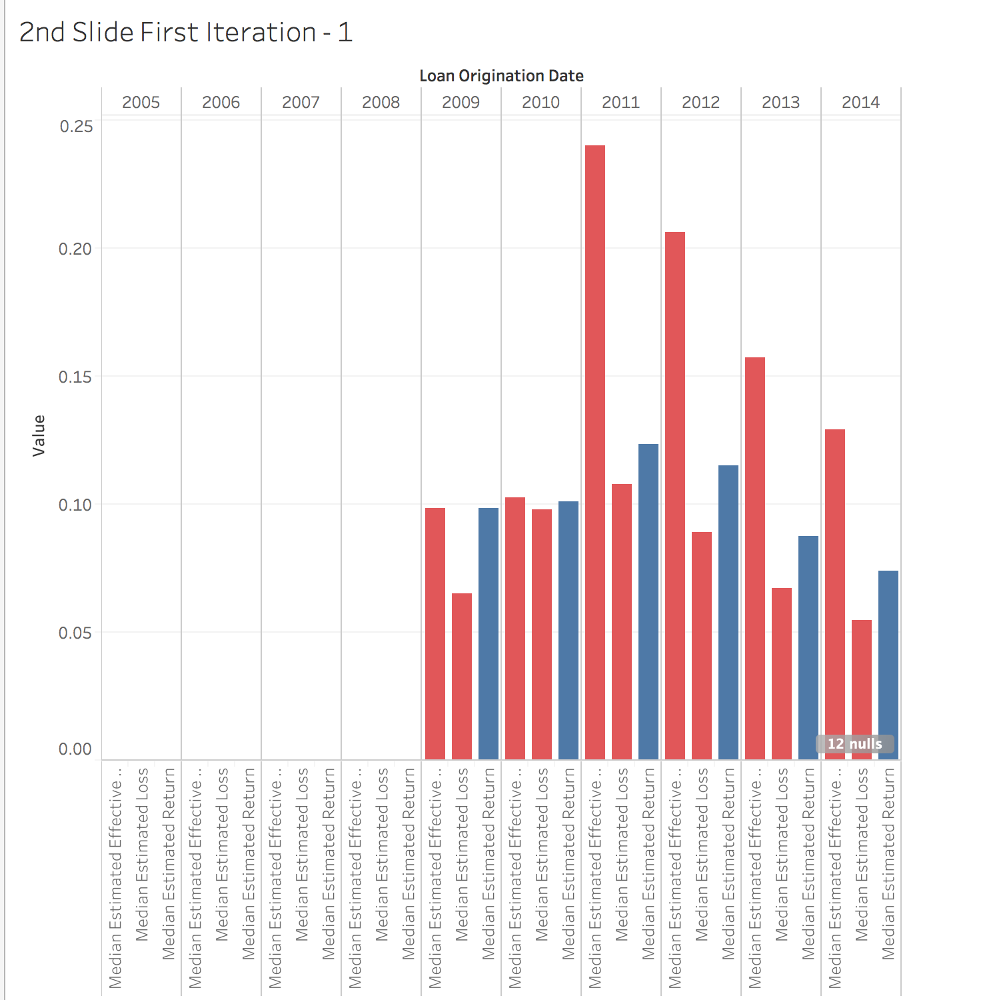
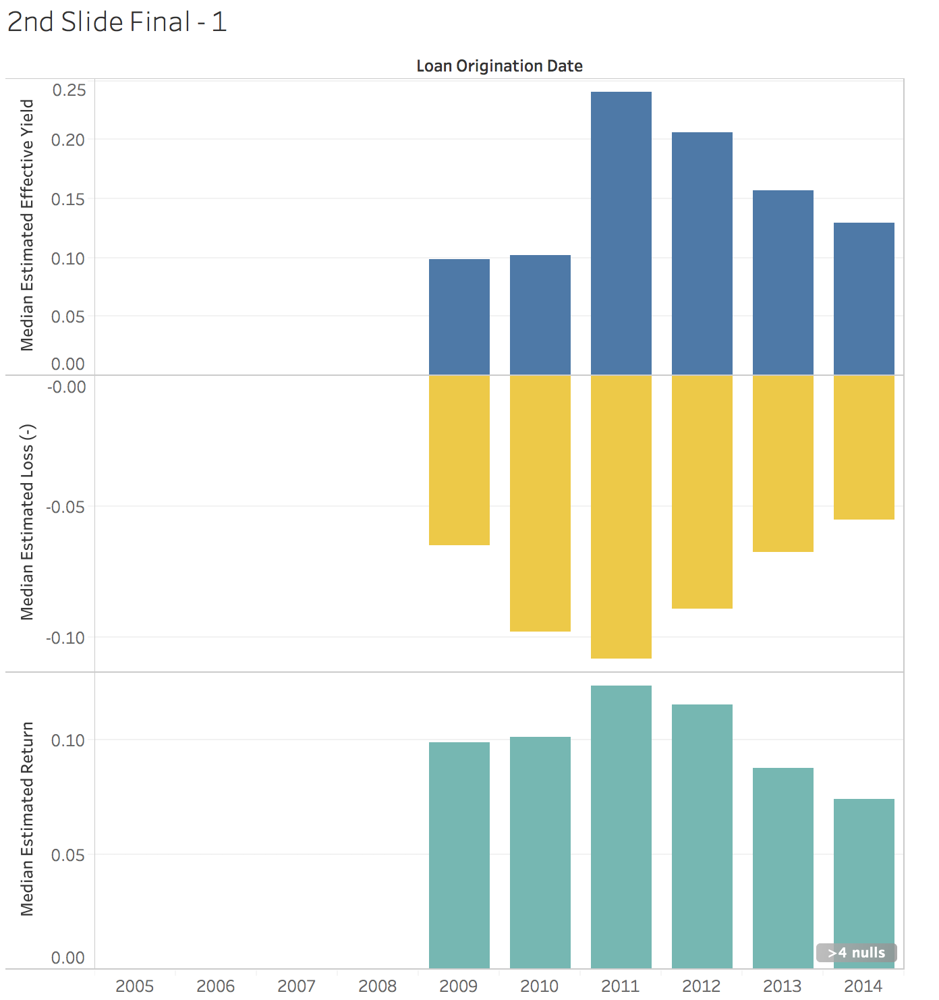

# Writeup
Prepared by Fienny Angelina. 
Final Public Tableau Story can be accessed here: https://public.tableau.com/profile/fienny.angelina#!/vizhome/ProsperLoanData_29/StoryFinal

Initial Public Tableau Story can be accessed here: https://public.tableau.com/profile/fienny.angelina#!/vizhome/ProsperLoanData_29/Storyinit?publish=yes

## Summary
This story is told using investor as the perspective. It utilize the data to determine:
1. whether the Prosper Loan is a safe investment tool
2. if it is, which portfolio should we choose. 

To answer the former question, we consider the default rate value, its variation and whether there are indicators to make educated guess to minimize it. The second question is narrowed to which Prosper Rating is best to invest on and analysed using the estimated loss and estimated return.

## Design
After collecting feedback, I focus on making each slide to carry exactly one message to the viewer to make each
point more concise. 

On the first slide, I focus on answering whether Prosper is a good investment tool. I decided to focus on the default rate as a measurement. I did not include charged off rate as during the charged off stage we can still sell our portfolio and gain back our investment. It is also still possible to obtain profit if we decide to wait and the lender eventually paid the loan. To get the default rate, we first create a column to see if that row is a defaulted loan, using this equation `IF [Loan Status] == 'Defaulted' THEN 1 ELSE 0 END` from which we can calculate the rate of defaulted easily.

On the second slide, I provide information on the estimated return value for each year when the loan started. It acts not only as a bridge from the first question to the second question, it also carries information that the Prosper investment tool is getting more stable with the cost of the declining investment return and provide brief context for the third slide. 

On the third slide, I focus on choosing the best portfolio to invest on based on the Prosper Rating. I focus on diversifying strategy that one can use to safely invest in the portfolio, based on their budget for investment. Budget matters here since each investor need to invest at least $25 dollar in each portfolio.

## Feedback
- On the first slide top left image, I try to focus on defaulted loan. However, what my viewer see is that the completed rate is huge compared to the defaulted rate. Based on that, I made the change to add mark for the defaulted rate to draw the user attention.

`Before`

`After`

- On the second slide, I wanted to show the comparison between Estimated Yield, Estimated Loss and the resulting Estimated Return. Initially I use side by side bar, however it looks unclear and makes it hard to compare across the date. After receiving that feedback, I try to use dual axis for all the three measurement for each year and created a negative value for the loss so that it lies below zero, which give clearer emphasises that it is something negative.

`Before`

`After`

- On the third slide, initially I just wanted to plot a few histogram comparing the default rate vs one other measure, like whether the borrower is home owner, the salary range, etc. However, it lacks focus. In the end, I decided to focus on which Propser Rating we should choose based on our budget. It is after I read that we need minimum $25 dollar for each investment and remember how diversifying could help strengthen our portfolio. 

## Resources
- https://www.prosper.com/
- https://www.lendacademy.com/the-difference-between-a-default-and-a-charge-off-at-lending-club/

